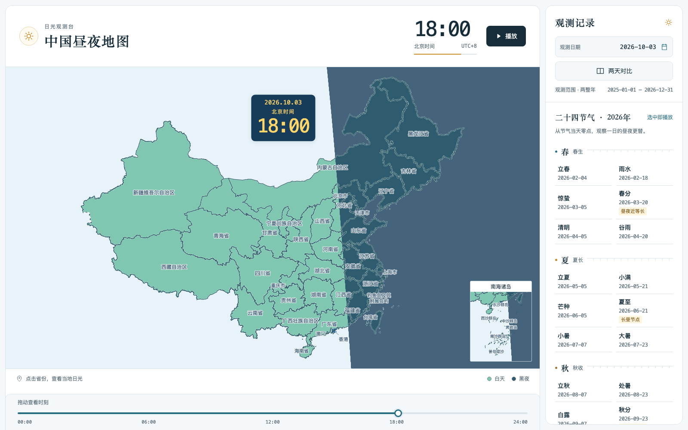
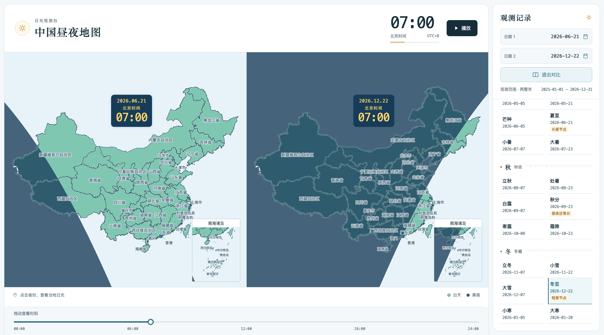
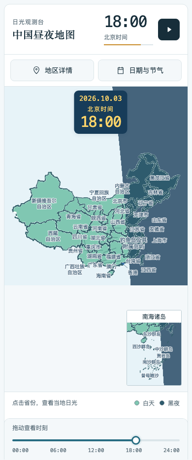

# 中国昼夜地图 · China Daylight Atlas

拖动时间，看白天与黑夜穿过中国。

同一个北京时间，东部可能已经入夜，西部仍有阳光。选择一天，观察昼夜交界怎样移动；并排对比夏至与冬至，看看季节怎样改变各地的白昼。

基于 Vue 3、TypeScript、MapLibre GL JS 与 Astronomy Engine。天文计算在浏览器完成，无需后端、账号或 API Key。

[快速开始](#快速开始) · [功能与操作](#功能与操作) · [数据与计算](#数据与计算) · [参与项目](#参与项目)



## 演示视频

<!-- 预留给维护者：在此粘贴自行录制的演示视频链接。 -->

## 可以探索什么

| 功能 | 体验 |
| --- | --- |
| 一日昼夜变化 | 从 00:00 到 24:00 播放，昼夜交界出现时自动放慢，方便观察变化 |
| 两天同步对比 | 两张地图共用北京时间和时间轴，比较不同日期、季节的昼夜分布 |
| 二十四节气 | 按四季展示当前年份的 24 个节气，点击即可从当天零点开始播放 |
| 省级地点详情 | 点击 34 个省级地区的名称或行政面，查看代表点的昼夜状态、日出、日落与昼长 |
| 桌面与手机布局 | 桌面使用右侧观测栏，窄屏使用日期和详情面板；底部时间轴始终可操作 |
| 钢琴伴奏 | 播放时伴随钢琴音乐；拖动时间轴后，音乐定位到相应的播放进度 |

### 夏至与冬至，同一个早晨

以下截图使用北京时间 07:00，左图为 2026 年夏至，右图为冬至。两张地图分别计算该日的太阳位置，主图与各自的南海附图同步更新。



### 手机上也能观察

手机保留完整的 34 个省级名称和南海附图，日期与节气、地区详情通过面板打开。

<p align="center">
  
</p>

An interactive daylight atlas of China with solar terms and synchronized date comparison. All astronomy calculations run in the browser; no backend or API keys are required.

## 快速开始

需要 Node.js 22 或更新的兼容版本，以及 npm。

```sh
git clone https://github.com/wenbochang888/china-daylight-atlas.git
cd china-daylight-atlas
npm ci
npm run dev
```

打开终端显示的本地地址，默认是 `http://localhost:5173`。同一局域网内的手机也可以访问终端显示的 Network 地址。

## 功能与操作

1. **选日期**：点击日期框打开中文日历。范围为北京时间上一年 1 月 1 日至当前年 12 月 31 日，包含当年未来日期，随年份滚动。
2. **观察一天**：点击播放，或拖动底部时间轴定位到任意分钟。时间轴支持方向键、Home 和 End；手动定位立即暂停。
3. **比较季节**：开启“两天对比”，分别选择两个日期。也可以先指定节气应用于日期 1 或日期 2，再点击节气。
4. **查看地点**：点击省名或行政面查看代表点详情。地图保持全国取景，选区不改变时间或视角。

所有时刻均按北京时间 UTC+8 解释，不受设备时区影响。`24:00` 表示所选日期结束时的次日零点，日期标签保持不变；播放到此停止，再次播放从同日 `00:00` 开始。进入后台自动暂停，返回后可手动继续。

全国完全白天或黑夜时每秒推进 90 分钟，出现昼夜交界时每秒推进 8 分钟；双日对比中任一天有交界就放慢。初次打开页面不会播放或预先下载音乐，双图共用一份音频；音乐播放失败时地图仍可继续。

## 怎样实现

| 模块 | 实现 |
| --- | --- |
| 页面与交互 | Vue 3 Composition API、TypeScript、Vite |
| 地图 | MapLibre GL JS 加载本站 GeoJSON，自定义 WebGL 图层绘制昼夜遮罩 |
| 太阳与节气 | Astronomy Engine 2.1.19，计算太阳向量和每隔 15° 的太阳视黄经节点 |
| 播放 | 按日期预计算全国快慢阶段，用实际经过时间跨分段推进 |
| 资源与部署 | 地图、依赖及音频随静态站点提供，使用相对资源路径支持子目录部署 |
| 验证工具 | Vitest 单元测试、Playwright 浏览器测试及地图数据一致性校验 |

运行时不请求第三方行政区、地图瓦片、字体或天文业务接口。当前界面提供省级选择，市县原始数据保留用于数据维护，界面不提供下钻。

## 构建与部署

```sh
npm run build
npm run preview
```

构建输出为 `dist/`，预览地址默认是 `http://localhost:4173`。将完整 `dist/` 部署到静态 HTTP 服务，保留其中的 `maps/` 与 `assets/`。请通过 HTTP 或 HTTPS 访问。

项目设置 `base: './'`，支持仓库子目录等部署方式。采用 GitHub Pages 时，可通过 GitHub Actions 执行构建并发布 `dist/`；构建产物无需提交到源码分支。

## 数据与计算

地图使用[天地图官方公开行政区网页](https://cloudcenter.tianditu.gov.cn/administrativeDivision)的固定快照，取得于 **2026-10-02**，源页面标示“2025 年 9 月局部更新”。包含 34 个省级、333 个市级、2883 个县级／对应层级节点及 3 个辅助区域，保留原始多部件、海岛与境界线。

地图快照不会随所选观测日期回溯行政区，也不表示实时行政调整。公开响应未显式声明坐标基准；项目保留原始经纬度，不施加 GCJ-02 偏移。详细来源、海岛注记、哈希与处理流程见[数据来源记录](docs/data/provenance.md)，逐省数量见[覆盖表](docs/data/coverage.md)。

太阳中心几何高度 **≥ −0.8333°** 为白天，低于该值为黑夜；地图与详情采用同一模型。节气按太阳视黄经求根，再转换为北京时间日期。相关模型与参考校验见[天文验证记录](docs/validation-observatory.md)。

地点详情只代表标明的代表点，同一省内可能同时存在白天和黑夜。模型不模拟天气、地形、建筑遮挡或观测点海拔；日出、日落与昼长属于模型计算结果。

## 开发与验证

```sh
npm run typecheck       # Vue / TypeScript 类型检查
npm run test:unit       # 单元测试
npm run data:check      # 原始与派生地图数据一致性
npm run build          # 类型检查与生产构建
```

浏览器测试首次运行前需安装浏览器：

```sh
npx playwright install chromium webkit
npm run test:e2e
```

`npm run data:prepare` 从正式原始快照生成 `public/maps/`，仅在需要重建数据时执行，随后运行 `npm run data:check`。更新快照的步骤见[数据来源记录](docs/data/provenance.md#更新方法)。

主要目录：

```text
src/
  components/      地图、日期、时间轴与详情组件
  composables/     播放与音频生命周期
  domain/          北京时间、太阳、节气与播放计算
  map/             图层、配色、标签与 WebGL 遮罩
  data/            静态资源加载与缓存
public/maps/       运行时地图资源
data/source/       正式地图快照与海岛注记
scripts/           数据生成、校验及专项检查
tests/             单元、浏览器测试与独立天文参考
```

已有验证记录按轮次保存：[地图与观测布局](docs/validation-layout-two-year.md)、[固定全国总览](docs/validation-fixed-map.md)、[日期与播放控制](docs/validation-controls-playback.md)、[音乐时间轴同步](docs/validation-audio-timeline.md)。这些记录描述各轮实际检查范围，不代表所有浏览器与设备始终通过。手机验证包含浏览器尺寸和触控模拟，尚未覆盖真实 iPhone／Android 设备。

本 README 截图来自当前页面的 Chromium 浏览器捕获，场景与检查结果见[截图记录](docs/showcase/capture.json)。

## 参与项目

欢迎通过 [Issue](https://github.com/wenbochang888/china-daylight-atlas/issues) 反馈问题或提出建议，通过 Pull Request 提交改进。

反馈问题时，请附上浏览器与设备信息、观测日期、北京时间、复现步骤，以及适用的截图或错误提示。涉及日期、天文或播放的修改请运行相关单元测试；涉及布局与交互的修改请检查桌面和窄屏表现；数据修改请遵循来源记录中的生成与校验流程。

## 许可证

自有源码、脚本与文档采用 [MIT 许可证](LICENSE)，版权署名为 `wenbochang888`。

第三方地图数据、钢琴音频及依赖适用各自的授权条件，不纳入本项目 MIT 许可范围。维护者已确认地图与现用音频获准使用及公开分发；独立复用第三方资源时请核实原授权范围，详见[第三方资源说明](THIRD_PARTY_NOTICES.md)。
