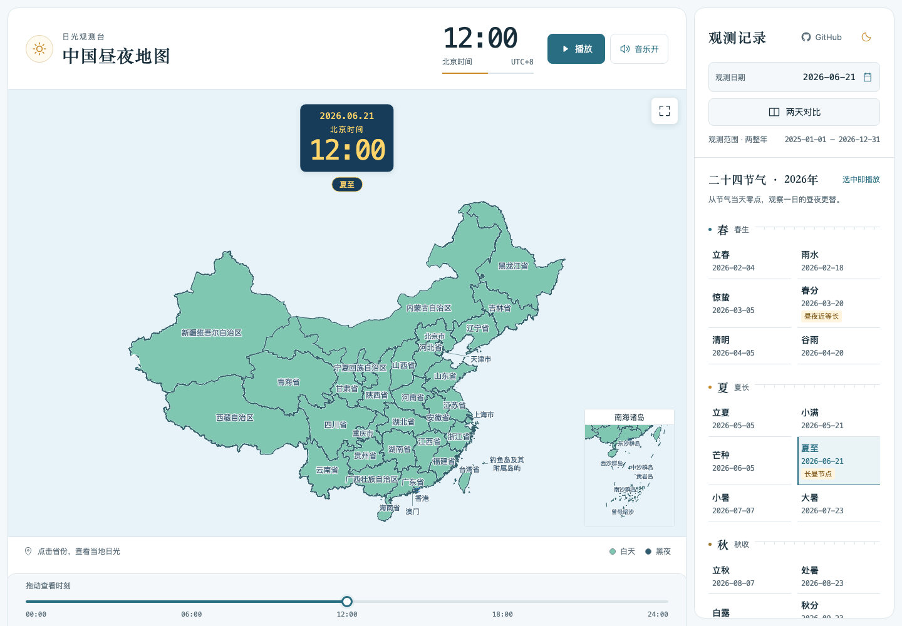
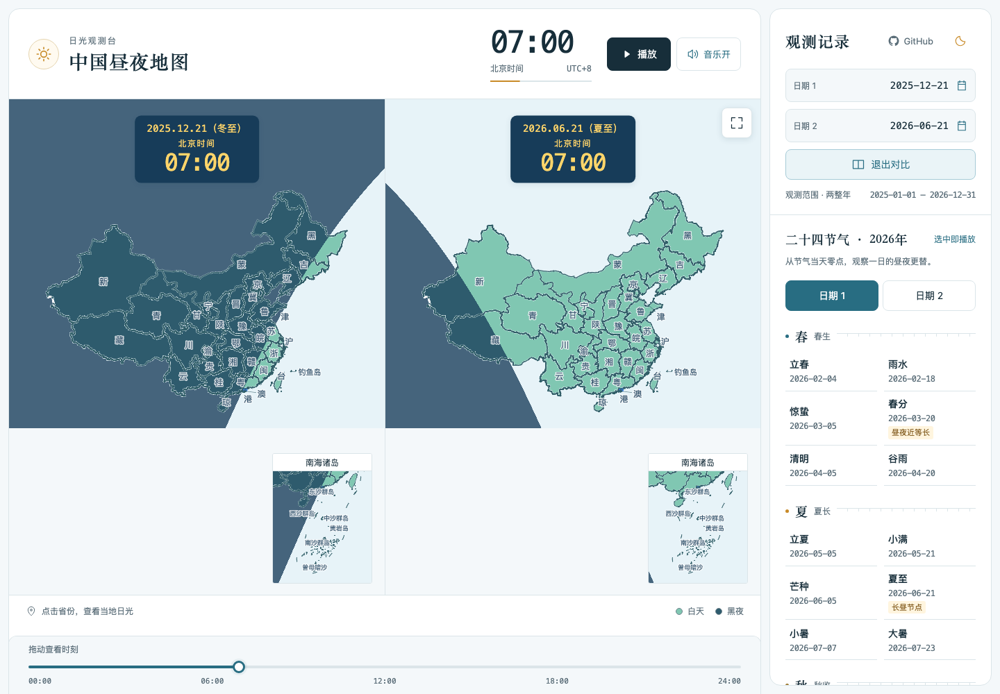
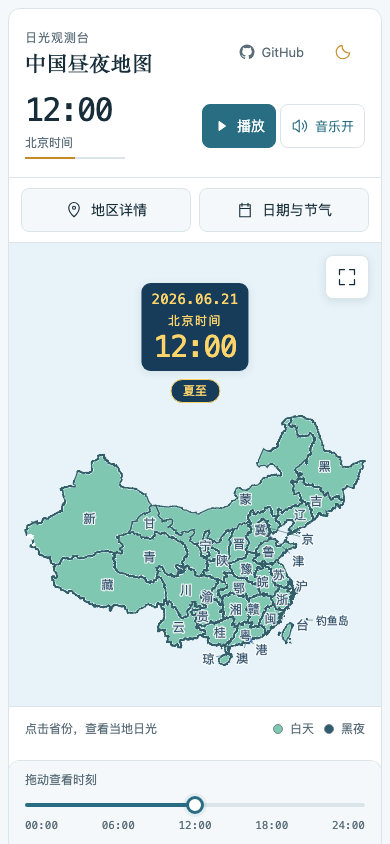

# 中国昼夜地图 · China Daylight Atlas

选择一天，拖动时间轴，看看中国各地的白天与黑夜怎样变化。同一个北京时间，东部可能已经入夜，西部仍有阳光；把夏至和冬至并排放在一起，还能看到季节带来的白昼变化。

项目使用 Vue 3、TypeScript、MapLibre GL JS 和 Astronomy Engine，天文计算在浏览器中完成。运行时无需后端、账号或 API Key。

[快速开始](#快速开始) · [功能与操作](#功能与操作) · [数据与计算](#数据与计算) · [参与项目](#参与项目)



## 演示视频

[在哔哩哔哩观看中国昼夜地图演示视频](https://www.bilibili.com/video/BV1VuHj6oEYD/)

## 功能

| 功能 | 说明 |
| --- | --- |
| 一日昼夜变化 | 播放 00:00 到 24:00 的变化，出现昼夜交界时自动放慢，便于观察 |
| 精选观测场景 | “看晨光”自动定位当天上午昼夜交界，“冬夏对比”配置当前年夏至／冬至07:00，“看此刻”定位点击时的北京时间；均保持暂停 |
| 关键时刻定位 | 点击顶部时间数字输入时分，支持24:00；地区详情可直接查看代表点日出／日落时刻 |
| 两天同步对比 | 两张地图共用北京时间和时间轴，可以比较不同日期或季节的昼夜分布 |
| 代表点对比摘要 | 选择省份后，直接比较日期2相较日期1的昼长、日出和日落变化 |
| 网页场景分享 | 复制当前日期、时刻和省份的链接，接收者可还原同一观测；仅网页提供 |
| 二十四节气 | 按四季列出当前年份的 24 个节气，点击后从当天零点开始播放 |
| 省级地点详情 | 点击 34 个省级地区的名称或行政面，查看代表点的昼夜状态、日出、日落和昼长 |
| 桌面与手机布局 | 桌面观测栏位于右侧，窄屏通过面板选择日期、查看详情；普通模式底部时间轴固定，手机地图使用省级简称并隐藏南海附图 |
| 地图全屏 | 一键全屏观察单图或双图，保留日期时间、播放／暂停和退出按钮，支持浏览器原生全屏与可视区域备用模式 |
| 钢琴伴奏 | 支持独立开关并记住选择，播放时跟随地图，拖动后定位到对应的音乐进度 |
| 明暗主题与源码入口 | 右上角切换亮色／暗色并记住选择，点击 GitHub 打开开源仓库 |

### 夏至与冬至对比

截图中两张地图都是北京时间 07:00，左边是 2025 年冬至，右边是 2026 年夏至。每张地图根据各自日期计算太阳位置，主图和南海附图同步更新，日期后用中文括号显示各自节气。



### 手机布局

手机显示 34 个省级简称（如粤、京、沪），优先放在所属省份内；小区域放不下时在附近空白处显示，并用细引线指向对应位置。钓鱼岛在手机和窄地图中显示短名称，宽桌面地图保留完整组名。手机隐藏南海附图并取消其底部留白。点击简称或行政面，详情仍显示完整地区名称；点击面板入口可以选择日期与节气。手机横屏继续采用这一显示方式。

<p align="center">
  
</p>

An interactive daylight atlas of China. Select a solar term or compare two dates at the same time. Astronomy calculations run in your browser, with no backend or API keys required.

## 快速开始

本地运行需要 Node.js 22 或更新的兼容版本，以及 npm。

```sh
git clone https://github.com/wenbochang888/china-daylight-atlas.git
cd china-daylight-atlas
npm ci
npm run dev
```

启动后，打开终端显示的地址，默认是 `http://localhost:5173`。手机与电脑处于同一局域网时，可以访问终端中的 Network 地址。

## 功能与操作

1. 点击日期框打开中文日历。可选范围为北京时间上一年 1 月 1 日至当前年 12 月 31 日，包含当年未来日期，每年更新。
2. 点击播放，或拖动底部时间轴定位到任意分钟。时间轴也支持方向键、Home 和 End，手动定位时立即暂停。
3. 开启“两天对比”，分别选择两个日期。使用节气选日时，先指定应用于日期 1 或日期 2，再点击节气。
4. 点击省名或行政面查看代表点详情。地图保持全国取景，选区不会改变时间或视角。
5. 点击地图右上角的全屏按钮，隐藏标题、观测栏和时间轴，仅保留地图、日期时间、播放／暂停与退出按钮。双图全屏按横向视口左右排列、纵向视口上下排列；点击退出或按 Escape 返回。进入和退出保留播放、音乐及当前时刻，暂停状态不会自动开始播放。全屏期间不打开地区详情。

每次打开或刷新页面，默认选择北京时间今天、`00:00`，并保持暂停。所有时刻都按北京时间 UTC+8 计算，不受设备时区影响。`24:00` 是所选日期结束时的次日零点，日期标签保持不变。播放到这里会停止，再次播放从同日 `00:00` 开始。页面进入后台时自动暂停，返回后需要手动继续。

### 精选场景、关键时刻与分享

普通地图顶部提供“看晨光／冬夏对比／看此刻”入口。晨光场景使用当天完整全国几何计算出的上午慢速区间，选择最长区间的中点；冬夏对比采用当前年夏至与冬至，共同定位07:00；此刻场景采用点击瞬间的北京时间，不持续跟随时钟。场景保留已选省份，定位后保持暂停，点击播放才开始演示。原二十四节气按钮仍然选中即播放。

切换精选场景时，地图和时间卡片先短暂淡出，等新场景与省名绘制完成后淡入；准备和结果提示使用固定空间，避免地图高度来回变化。系统开启“减少动态效果”时取消淡入淡出。

点击顶部时间数字打开“设置北京时间”，填写小时、分钟后点击“定位”，或按Enter确认；24小时只接受00分钟。打开弹窗会暂停播放，取消或Escape保留原时刻并保持暂停。地图内部和全屏日期时间卡片继续只读。

地区详情中的“查看日出／查看日落”将共享时间定位到该代表点对应的显示分钟。双图中点击任一天的事件，两张地图同步到这一北京时间，各自日期不变；手机会关闭详情返回地图。缺少事件时不能定位。双日详情新增“日期2相较日期1”的昼长、日出与日落摘要，按明细显示的整数分钟比较；全部结果只代表同一代表点。

网页探索栏的“分享”会暂停当前观测，提供“复制链接”和“复制说明与链接”。复制失败时可手动复制链接。分享使用当前站点与子目录，携带观测日期、共同分钟和可选省份，不包含播放、主题、音乐偏好；iPhone App不显示分享入口。

有效分享链接首次打开时，在地图创建前还原场景并保持暂停；手机恢复高亮但不自动打开详情。处理后移除链接中的场景片段，普通刷新回到今天00:00，再次打开原分享链接可以再次还原。非法或超出当前两年范围的链接明确提示并打开默认观测，不静默修改分享日期；未知省份仅丢弃地区信息，仍还原合法日期与时间。同一已打开网页中访问场景片段会重新加载并执行相同还原流程。

全国完全处于白天或黑夜时，每秒推进 90 分钟；出现昼夜交界时，每秒推进 8 分钟。双日对比中，只要有一天出现交界，两张图就一起放慢。

日期时间卡片在每张地图中水平居中，沿用“日期、北京时间、HH:mm”三行显示。手机、PC、普通模式与全屏模式采用相同规则。所选日期恰逢节气时，在日期后同一行显示括号名称，例如“2026.06.21（夏至）”；手动选日和节气入口均可触发，上一年日期也能识别。双图分别显示各自节气，24:00仍属于所选日期。日期行预留节气宽度，名称出现或消失不会移动地图。下方独立标签已移除，页面上方单图截图保留为此前布局参考。

时间卡片完整位于中国轮廓上方，手机／窄图留12px、宽图留16px，不遮住地图。手机竖屏全屏对比中，日期1保持在上、日期2保持在下，上图向下、下图向上靠近中间分隔线；两图比例一致，各自安全区单独计算，尽量放大地图供省级简称排布。播放／退出按钮在右上角上下排列。普通对比与横屏左右对比沿用原布局。

浏览器不支持原生全屏或拒绝请求时，地图自动铺满浏览器可视区域，浏览器自身的地址栏可能继续显示。手机显示模式为视口宽度不超过 600px，或高度不超过 600px 且主要使用触摸、没有悬停能力；其他宽度小于 600px 的地图也使用简称，宽桌面地图保留完整名称。

初次打开页面不会播放或预先下载音乐，双图共用一份音频。播放按钮旁的音乐开关默认开启，并记住上次选择；关闭音乐时地图继续播放，重新开启时定位到当前地图对应的音乐进度。音乐播放失败时，地图仍可继续播放。

GitHub 与明暗切换融入顶部标题区：电脑端位于“观测记录”旁，窄屏位于地图标题右侧，时间、播放和音乐排列在下一行。GitHub 在新标签页打开本项目仓库；月亮按钮切换为暗色，太阳按钮切换为亮色，悬停可查看操作提示。默认亮色，并记住上次选择；浏览器存储不可用时仍可在当前页面切换。页面、控件、日历和详情面板同步切换主题，地图昼夜配色保持一致，观测日期、时刻、选区和播放状态保持。

## 技术实现

| 模块 | 实现 |
| --- | --- |
| 页面与交互 | Vue 3 Composition API、TypeScript、Vite |
| 地图 | 省级 GeoJSON 随程序内置，MapLibre GL JS 与自定义 WebGL 图层绘制地图和昼夜遮罩 |
| 太阳与节气 | 使用 Astronomy Engine 2.1.19 计算太阳向量，以及太阳视黄经每隔 15° 的节点 |
| 播放 | 按日期预计算全国快慢阶段，根据实际经过的时间跨分段推进 |
| 资源与部署 | 地图、依赖及音频随静态站点提供，使用相对资源路径支持子目录部署 |
| 验证工具 | Vitest 单元测试、Playwright 浏览器测试及地图数据一致性校验 |

首屏必需地图数据随程序打包，省级目录、标签与主图展示计算由主图、附图和双图复用；地图显示后再准备全国播放分段。首次仍需下载网站程序，后续访问可复用浏览器对版本化资源的缓存。当前页面不请求 `maps/` 下的 JSON 或市县分片，也不在后台额外下载市县数据。

运行时不请求第三方行政区、地图瓦片、字体或天文业务接口。界面目前只支持选择省级地区，市县原始数据仍保留用于维护，但不提供下钻操作。

## 构建与部署

```sh
npm run build
npm run preview
```

构建结果保存在 `dist/`，默认预览地址是 `http://localhost:4173`。部署时将完整的 `dist/` 放到静态 HTTP 服务上，保留其中的 `maps/` 和 `assets/`，通过 HTTP 或 HTTPS 访问。

项目设置了 `base: './'`，支持部署到仓库子目录等路径。使用 GitHub Pages 时，可以通过 GitHub Actions 构建并发布 `dist/`，无需把构建产物提交到源码分支。

## iPhone 真机与 TestFlight

仓库已接入 Capacitor 8，本地资源包运行现有 Vue 地图，目标为 iPhone、iOS 17 起。此阶段只做真机验证和本人 TestFlight 内部测试。

```sh
npm run ios:sync        # 构建、准备离线资源并同步 iOS 工程
npm run ios:open        # 打开 Xcode
npm run test:ios:web    # App 资源包的手机 WebKit 检查
```

在 Xcode 的 App → Signing & Capabilities 选择自己的开发团队，连接 iPhone，选中设备并运行。版本与构建号统一由 `ios-app.json` 管理；每次上传前递增 buildNumber，再执行 `ios:sync`。完整操作、TestFlight 说明及真机验收表见 [iOS 开发与测试指南](docs/ios-development.md)，本轮验证见 [iOS 验证记录](docs/validation-ios-app.md)。

## 数据与计算

地图数据来自[天地图官方公开行政区网页](https://cloudcenter.tianditu.gov.cn/administrativeDivision)，使用的是 2026-10-02 取得的固定快照。源页面标示“2025 年 9 月局部更新”。快照包含 34 个省级、333 个市级、2883 个县级／对应层级节点及 3 个辅助区域，保留了原始多部件、海岛和境界线。

观测日期改变时，地图仍使用同一快照，无法反映历史或实时行政调整。公开响应未显式声明坐标基准，项目保留原始经纬度，不施加 GCJ-02 偏移。数据来源、海岛注记、哈希和处理流程见[数据来源记录](docs/data/provenance.md)，逐省数量见[覆盖表](docs/data/coverage.md)。

太阳中心几何高度 ≥ −0.8333° 时判定为白天，低于该值为黑夜，地图和详情使用同一模型。节气日期通过太阳视黄经求根，再转换为北京时间日期。模型与参考校验见[天文验证记录](docs/validation-observatory.md)。

地点详情只代表标明的代表点，同一省内可能同时存在白天和黑夜。模型不模拟天气、地形、建筑遮挡或观测点海拔；日出、日落与昼长属于模型计算结果。

## 开发与验证

```sh
npm run typecheck       # Vue / TypeScript 类型检查
npm run test:unit       # 单元测试
npm run data:check      # 原始与派生地图数据一致性
npm run build          # 类型检查与生产构建
```

四项观测体验的针对性验证见[本次记录](docs/validation-observation-explore.md)。生产构建后可运行 `node scripts/observation-check.mjs`，仅检查桌面和360px手机的 `/atlas/` 分享与场景操作，不是完整回归或性能测试。

首次运行浏览器测试前，先安装所需浏览器：

```sh
npx playwright install chromium webkit
npm run test:e2e
```

需要重建地图数据时，运行 `npm run data:prepare`，从正式原始快照生成 `public/maps/` 和 `src/data/generated/national-map.json`，然后执行 `npm run data:check`。更新快照的步骤见[数据来源记录](docs/data/provenance.md#更新方法)。

主要目录：

```text
src/
  components/      地图、日期、时间轴与详情组件
  composables/     播放与音频生命周期
  domain/          北京时间、太阳、节气与播放计算
  map/             图层、配色、标签与 WebGL 遮罩
  data/            静态资源加载与缓存
public/maps/       运行时地图资源
data/source/       正式地图快照与海岛注记
scripts/           数据生成、校验及专项检查
tests/             单元、浏览器测试与独立天文参考
```

首屏、零点初始化与音乐开关的结果见[验证记录](docs/validation-startup-music.md)，GitHub 入口与明暗主题的最新结果见[页面工具验证](docs/validation-header-tools.md)，部署缓存配置见[部署说明](docs/deployment-cache.md)。

本轮全屏与手机简称的检查命令为构建后执行 `node scripts/static-check.mjs --fullscreen-mobile --audio-timeline`，结果见[全屏与手机布局验证](docs/validation-fullscreen-mobile.md)。

各轮验证记录分别保存在[地图与观测布局](docs/validation-layout-two-year.md)、[固定全国总览](docs/validation-fixed-map.md)、[日期与播放控制](docs/validation-controls-playback.md)和[音乐时间轴同步](docs/validation-audio-timeline.md)中。每份记录列有当轮的结果和检查范围。手机目前只做了浏览器尺寸和触控模拟，尚未在真实 iPhone／Android 设备上验证。

展示截图使用 Chromium 捕获当前页面，场景和检查结果见[截图记录](docs/showcase/capture.json)。

## 参与项目

发现问题或有建议，可以提交 [Issue](https://github.com/wenbochang888/china-daylight-atlas/issues)；代码改进可以通过 Pull Request 提交。

反馈时请说明浏览器、设备、观测日期和北京时间，写出复现步骤，并附上相关截图或错误提示。修改日期、天文或播放逻辑后，请运行相关单元测试。布局和交互改动需要检查桌面与窄屏表现，数据改动则按来源记录中的流程生成、校验。

## 许可证

自有源码、脚本与文档采用 [MIT 许可证](LICENSE)，版权署名为 `wenbochang888`。

第三方地图数据、钢琴音频及依赖适用各自的授权条件，不纳入本项目 MIT 许可范围。维护者已确认地图与现用音频获准使用及公开分发；独立复用第三方资源时请核实原授权范围，详见[第三方资源说明](THIRD_PARTY_NOTICES.md)。

## 注意事项：自有服务器部署与更新

服务器源码目录为 `/root/work/workspace/china-daylight-atlas`，构建产物目录为其中的 `dist/`。计划访问入口为 `https://www.gdufe888.top/sun/`。生成 `dist/` 只是完成构建，还需要 Nginx 配置生效，才能通过域名访问。

### 使用 Docker 生成 dist/：以后更新代码的步骤

**在服务器项目目录执行以下命令，即可重新生成 `dist/`：**

```sh
docker run --rm \
  -v "$PWD":/app \
  -v /app/node_modules \
  -w /app \
  node:22-alpine \
  sh -c 'npm ci --include=dev && npm run build'
```

`npm ci --include=dev` 按锁文件安装构建所需依赖；实际生成 `dist/` 的是 `npm run build`。项目目录挂载到容器的 `/app`，所以结果直接保存在服务器的 `/root/work/workspace/china-daylight-atlas/dist/`，无需从容器复制。`node_modules` 使用独立临时卷，避免混用宿主机依赖；容器退出后自动删除。

构建成功后，检查产物并刷新网站


新版资源缓存及 gzip 的 Nginx 配置见[部署缓存说明](docs/deployment-cache.md)。源码改动仍需重新构建并更新服务器产物，线上缓存配置需由维护者应用。
